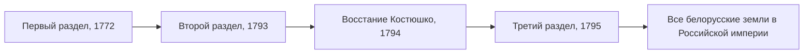

> За 23 года одно из крупнейших государств Европы исчезло с карты, а все белорусские земли оказались в Российской империи.

## Три раздела

Первый раздел Речи Посполитой между Россией, Пруссией и Австрией был подписан 25 июля (5 августа) 1772 года. К России отошла восточная часть белорусских земель с Полоцком, Витебском и Могилёвом. Второй раздел последовал в 1793 году. Восстание под руководством [[by-kosciuszko-1794|Тадеуша Костюшко]] в 1794 году попыталось спасти государство, но было подавлено, и в 1795 году третий раздел поделил его остатки.

## Новое устройство

Империя быстро встраивала новые земли в свою систему управления. Уже в 1773 году в Могилёвской губернии по указу Сената учредили судебные и исполнительные органы, а Екатерина II утвердила доклад Сената о новой административной системе.

Но многое из прежнего порядка сохранялось долго. Действовал [[by-statut-1588|Статут ВКЛ]], большинство крестьян оставались прихожанами униатской церкви.

## Перелом 1830-х годов

После восстания 1830–1831 годов политика изменилась. Участие униатов в восстании подтолкнуло Николая I к решению церковного вопроса, и в 1839 году [[by-uniate-1839|Полоцкий собор]] объявил о воссоединении униатов с православной церковью. В 1840 году отменили Статут ВКЛ. Край в официальном языке стали называть Северо-Западным.

| Год | Что ушло |
| --- | --- |
| 1772–1795 | государство Речь Посполитая |
| 1839 | униатская церковь |
| 1840 | Статут ВКЛ |

Следующим крупным восстанием на этих землях стало восстание 1863–1864 годов, с которым связано имя [[by-kalinouski-1863|Кастуся Калиновского]].

## В это же время

> Одновременно с разделами во Франции идёт [[fr-revolution-1789|революция]]. Европа видит две противоположные истории: на западе рождается новое государство, на востоке соседи уничтожают старое.
