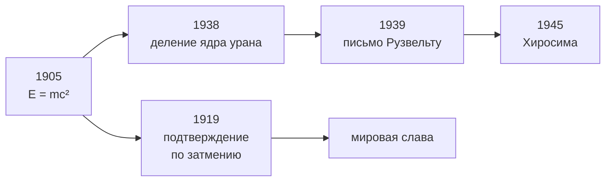

> Служащий патентного бюро третьего класса за один год перевернул физику.

## Четыре статьи за двенадцать месяцев

В 1905 году Альберт Эйнштейн работал экспертом в патентном бюро Берна, занимался
наукой по вечерам и не имел ни лаборатории, ни научного руководителя. За год он
отправил в *Annalen der Physik* четыре работы, любой из которых хватило бы
на репутацию крупного учёного.

### 1. Фотоэффект

Свет ведёт себя как поток порций энергии — квантов. Энергия одного кванта:

$$
E = h\nu
$$

где $h$ — постоянная Планка, $\nu$ — частота. Именно за эту работу, а не
за относительность, Эйнштейн получил Нобелевскую премию 1921 года.

### 2. Броуновское движение

Дрожание пыльцы в воде объясняется ударами молекул. Средний квадрат смещения
частицы за время $t$:

$$
\langle x^2 \rangle = 2Dt
$$

Это стало решающим доводом в пользу того, что атомы существуют физически,
а не только как удобная гипотеза.

### 3. Специальная теория относительности

Скорость света одинакова для всех наблюдателей. Отсюда следует, что время
и длина зависят от движения:

$$
t' = \gamma t, \qquad \gamma = \frac{1}{\sqrt{1 - \dfrac{v^2}{c^2}}}
$$

При обычных скоростях $\gamma \approx 1$, и мы ничего не замечаем.
При $v = 0{,}87c$ множитель равен двум: движущиеся часы идут вдвое медленнее.

### 4. Эквивалентность массы и энергии

Самое известное уравнение в истории:

$$
E = mc^2
$$

Масса и энергия — одно и то же в разных единицах. Множитель $c^2$ огромен,
поэтому в грамме вещества заключено около $9 \cdot 10^{13}$ джоулей — примерно
столько даёт сжигание двух тысяч тонн угля.

## Что было дальше

Германия начала века была научной столицей мира. Через 28 лет Эйнштейну пришлось
её покинуть, и вместе с ним уехали десятки физиков и математиков. Страна потеряла
своё главное преимущество за один политический сезон.

---

*Подробнее: [Год чудес](https://ru.wikipedia.org/wiki/Annus_Mirabilis_(Эйнштейн)).*
