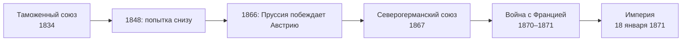

> Германия объединилась не через парламент, а через таможню, армию и дипломатию Пруссии.

## Сначала рынок, потом государство

После [[de-hre-end-1806|конца Священной Римской империи]] немецкие земли оставались десятками
отдельных государств. Первым общим пространством стал не политический союз, а
[[de-zollverein-1834|Таможенный союз 1834 года]]: он объединил рынок вокруг Пруссии и без Австрии.
Попытка объединить страну снизу, через выборный парламент, провалилась в
[[de-1848|1848–1849 годах]] — прусский король отказался от короны из рук депутатов.

## Три войны и один союз

| Год | Событие | Итог для объединения |
| --- | --- | --- |
| 1864 | [[ref-p063-voyna-prussii-i-avstrii-protiv-danii]] | Шлезвиг и Гольштейн выходят из-под власти Дании |
| 1866 | [[ref-p063-voyna-prussii-i-italii-protiv-avstrii]] | Германский союз распущен, Австрия исключена из немецких дел |
| 1867 | [[ref-p063-obrazovanie-severogermanskogo-soyuza]] | Федерация к северу от Майна под главенством Пруссии |
| 1870–1871 | [[ref-p064-franko-prusskaya-voyna]] | Южногерманские государства присоединяются к союзу |

Конституция Северогерманского союза, подготовленная Бисмарком, дала Пруссии решающий голос
в Союзном совете и ввела всеобщее избирательное право мужчин на выборах в рейхстаг.
Эта конструкция и стала каркасом новой империи.

## Что получила новая империя

18 января 1871 года в Версале прусского короля Вильгельма I провозгласили германским императором.
Выбор места — дворец побеждённой Франции — надолго отравил отношения двух стран
(см. [[fr-third-republic-1871]]).

Империя быстро стала одной из ведущих промышленных держав. При Бисмарке приняли
[[ref-p065-zakony-o-socialnom-strahovanii-v-germanii|первые в мире законы о социальном страховании]], а в 1884–1885 годах Берлин принимал
[[ref-p065-berlinskaya-konferenciya|конференцию держав по Африке]]; в эти же годы
Германия обзавелась колониями.

## В это же время

> Почти одновременно, в 1859–1861 годах, [[ref-p062-obedinenie-italii|объединяется Италия]] — тоже вокруг одного
> королевства и тоже через войны с Австрией.
