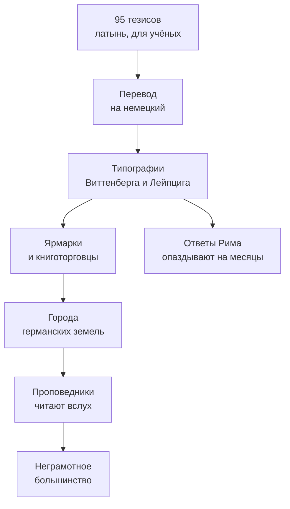

> Монах хотел академического спора об индульгенциях, а получил раскол западного христианства.

## Что случилось 31 октября 1517 года

Мартин Лютер, профессор богословия в Виттенберге, разослал **95 тезисов** против торговли
индульгенциями — грамотами, которые церковь продавала как избавление от наказания за грехи.
По преданию, он прибил их к двери Замковой церкви; документально подтверждено другое —
он отправил их архиепископу Майнцскому и коллегам-богословам.

Тезисы были написаны *на латыни* и адресованы учёным. Но кто-то перевёл их на немецкий,
отдал в типографию — и дальше сработала техника.

## Почему это разошлось так быстро

Печатный станок [Гутенберга](https://ru.wikipedia.org/wiki/Гутенберг,_Иоганн) к тому моменту
работал в Германии уже шестьдесят лет. Раньше подобные споры оставались внутри университетов;
теперь текст расходился за недели.

| Что | Раньше | После 1517 |
| --- | --- | --- |
| Скорость распространения идеи | месяцы и годы | недели |
| Тираж богословского текста | десятки рукописей | тысячи оттисков |
| Язык | латынь для учёных | немецкий для всех |

За три года Лютер выпустил около тридцати сочинений общим тиражом свыше трёхсот тысяч
экземпляров. Это первый в истории случай, когда идея разошлась по континенту как товар.

## Как расходилась идея

Последнее звено важнее всего: до печатного станка идея останавливалась там,
где кончались грамотные. Дешёвая брошюра, прочитанная вслух с амвона или на площади,
доходила и до тех, кто читать не умел.

## Три следствия, которые пережили спор об индульгенциях

1. **Религиозное.** Единая западная церковь распалась. Оттуда — Крестьянская война 1525 года,
   Аугсбургский мир 1555-го и Тридцатилетняя война.
2. **Языковое.** Перевод Библии на немецкий свёл десятки диалектов к одной литературной норме.
   Лютер, по сути, написал язык, на котором говорит современная Германия.
3. **Политическое.** Князья получили основание забрать церковные земли — и охотно им
   воспользовались. Реформация быстро перестала быть делом низов.

## В это же время

> В том же 1517 году [[by-skaryna-1517|Франциск Скорина]] печатает в Праге первую книгу
> на старобелорусском языке.
> Два человека, не знавшие друг о друге, делают одно и то же движение: берут печатный станок
> и переводят священный текст на язык, понятный своим.

---

*Германские земли · Священная Римская империя. Ранние века этой колонки — не современная
Германия в строгом смысле, а традиция, из которой она выросла.*
