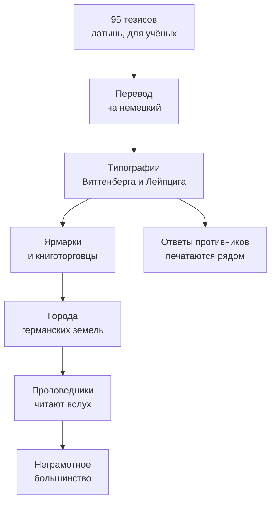

> Монах хотел академического спора об индульгенциях, а получил раскол западного христианства.

## Что случилось 31 октября 1517 года

Мартин Лютер, профессор богословия в Виттенберге, разослал **95 тезисов** против практики
индульгенций — отпущения установленного церковью временного наказания за уже прощённые грехи.
По преданию, он прибил их к двери Замковой церкви; документально подтверждено другое —
он отправил их архиепископу Майнцскому и коллегам-богословам.

Тезисы были написаны *на латыни* и адресованы учёным. Но кто-то перевёл их на немецкий,
отдал в типографию — и дальше сработала техника.

## Почему это разошлось так быстро

Печатная технология [[de-gutenberg-1455|Гутенберга]] к тому моменту
работал в Германии уже шестьдесят лет. Раньше подобные споры оставались внутри университетов;
теперь текст расходился за недели.

| Что | Раньше | После 1517 |
| --- | --- | --- |
| Скорость распространения идеи | месяцы и годы | недели |
| Тираж богословского текста | десятки рукописей | тысячи оттисков |
| Язык | преимущественно латынь | латынь и немецкий для разных аудиторий |

За три года Лютер выпустил около тридцати сочинений общим тиражом свыше трёхсот тысяч
экземпляров. Реформационная полемика стала одним из первых европейских примеров того,
как массовый рынок коротких печатных текстов меняет общественный спор.

## Как расходилась идея

Печать не отменяла устную культуру. Наоборот, дешёвую брошюру могли пересказать,
прочитать вслух с кафедры или обсудить на площади — так текст доходил и до неграмотной
части общества.

## Три следствия, которые пережили спор об индульгенциях

1. **Религиозное.** Спор стал частью раскола западного христианства; его формы зависели
   от проповедников, городов и решений князей.
2. **Языковое.** Перевод Библии усилил общую письменную норму немецкого языка, которая
   складывалась и до Лютера.
3. **Политическое.** Часть князей поддержала реформу, получила контроль над церковными
   институтами и имуществом и тем самым закрепила раскол.

## В это же время

> В том же 1517 году [[by-skaryna-1517|Франциск Скорина]] печатает в Праге Псалтырь
> на церковнославянском языке белорусской редакции. Проекты не связаны напрямую,
> но оба приспосабливают печатную книгу к региональной аудитории.

---

*Германские земли · Священная Римская империя. Ранние века этой колонки — не современная
Германия в строгом смысле, а традиция, из которой она выросла.*
