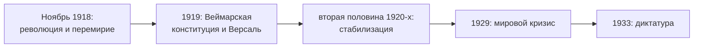

> Первая германская демократия родилась из поражения и все четырнадцать лет жила под его тенью.

## Рождение: ноябрь 1918 — лето 1919

Республика возникла не по плану. Восстание моряков в Киле 3 ноября 1918 года за несколько дней
переросло в [[ref-p077-noyabrskaya-burzhuazno-demokraticheskaya-r|Ноябрьскую революцию]]:
9 ноября было объявлено об отречении Вильгельма II, и Филипп Шейдеман провозгласил республику.
Через два дня представители новой власти подписали
[[ref-p077-podpisanie-peremiriya-mezhdu-germaniey-i-s|Компьенское перемирие]].

Зимой и весной 1919 года сторонники советской власти пытались повернуть революцию по русскому
образцу — в Берлине, Бремене, Мюнхене. Правительство социал-демократов подавило эти выступления
с помощью армии и добровольческих отрядов. Победил парламентский путь: в 1919 году Национальное собрание
приняло в Веймаре конституцию — отсюда название республики.

## Груз Версаля

[[ref-p079-podpisanie-germaniey-versalskogo-mirnogo-d|Версальский договор]] лишил страну
колоний и части территорий, ограничил армию 100 тысячами человек и возложил на Германию
ответственность за ущерб от войны. Сумму репараций — 132 млрд золотых марок — определили
в 1921 году. Договор стал главным предметом спора в политике республики.

## Короткая стабилизация

| Год | Событие |
| --- | --- |
| 1922 | [[ref-p080-genuezskaya-konferenciya-podpisanie-rapall]] |
| 1925 | [[ref-p081-lokarnskaya-konferenciya]] |
| 1926 | [[ref-p090-podpisanie-sovetsko-germanskogo-dogovora-o]] |
| 1926 | [[ref-p082-vstuplenie-germanii-v-ligu-naciy]] |

Внешнеполитическая линия Густава Стреземана вернула Германию в круг равноправных держав:
договоры одновременно с Западом и с Москвой.

## Конец

Мировой экономический кризис 1929 года обрушил эту стабильность. 30 января 1933 года
Гитлер стал канцлером ([[de-1933]]), и за несколько месяцев республика превратилась
в диктатуру. 14 октября 1933 года нацистское правительство вывело Германию из Лиги Наций.

