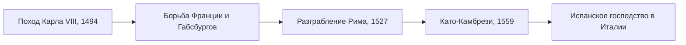

> Италия Возрождения на шестьдесят пять лет превратилась в поле битвы чужих армий.

## Повод

В 1494 году французский король Карл VIII потребовал Неаполитанское королевство,
на которое у него были наследственные притязания, и повёл армию через Альпы. Он дошёл
до Неаполя и занял его. Успех напугал остальных: против Франции сложилась Венецианская
лига — папа Александр VI, Венеция, Испания и император Максимилиан I, — и Карлу
пришлось уйти из Италии.

## Долгая война

Поход 1494–1495 годов оказался только первым. Следующие десятилетия Франция,
император, Испания и почти все итальянские государства воевали за Милан, Неаполь
и влияние на папу. Союзы распадались и складывались заново: итальянские правители
переходили с одной стороны на другую, пытаясь не допустить полной победы ни одной
из держав.

Самой тяжёлой для Италии точкой стал 1527 год. Папа Климент VII вступил в
Коньякскую лигу против императора Карла V, и армия императора, вышедшая из подчинения,
[[it-sack-rome-1527|разграбила Рим]].

## Чем всё закончилось

| Что | Итог мира в Като-Камбрези, 3 апреля 1559 года |
| --- | --- |
| Франция | Отказалась от притязаний на Милан |
| Савойя | Получила обратно Савойю и Пьемонт |
| Генуя | Вернула Корсику |
| Испания | Стала господствующей силой в Италии почти на полтора века |

## Война и культура

На эти же десятилетия приходится Высокое Возрождение: [[it-leonardo-1498|Леонардо]],
[[it-raphael-1511|Рафаэль]] и [[it-michelangelo-1512|Микеланджело]] работали для тех
самых правителей, чьи государства были втянуты в войну. Отстранённый от дел флорентийский
чиновник [[it-machiavelli-1513|Макиавелли]] писал «Государя» в разгар этих войн.
