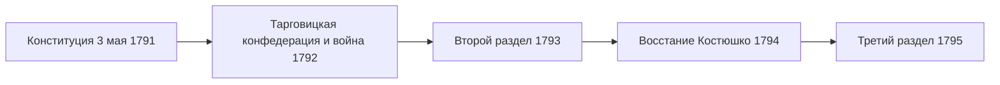

> Попытка реформировать государство изнутри оказалась настолько успешной, что соседи предпочли его уничтожить.

## Почему понадобилась конституция

После первого раздела 1772 года Речь Посполитая потеряла около трети территории, а её
политическое устройство оставалось прежним: выборный король, слабая казна и
**liberum veto** — право любого депутата сорвать решения сейма. Соседи, прежде всего Россия,
пользовались этим, чтобы держать страну под своим влиянием.

В 1788 году в Варшаве собрался сейм, который заседал четыре года и потому вошёл
в историю как Четырёхлетний, или Великий. Пока Россия воевала с Турцией и Швецией,
у реформаторов появилось окно возможностей.

## Что устанавливал Правительственный устав

- **Отмена liberum veto** и решение дел большинством голосов.
- **Наследственный трон** вместо выборов короля после смерти каждого монарха.
- **Разделение властей** на законодательную, исполнительную и судебную.
- **Мещане** получили часть политических прав, сближавших их со шляхтой.
- **Крестьяне** были «взяты под опеку закона»; крепостное право не отменялось.

Документ приняли 3 мая 1791 года в Королевском замке в Варшаве; затем король
Станислав Август и депутаты прошли в собор Святого Иоанна, чтобы принести присягу.

## Что произошло дальше

Магнаты, недовольные реформой, объединились в Тарговицкую конфедерацию и позвали
на помощь Россию. Война 1792 года закончилась поражением, второй раздел отменил
конституцию, а после подавления восстания [[by-kosciuszko-1794|Тадеуша Костюшко]]
государство исчезло ([[by-partitions-1795]]).

## Память

Конституция просуществовала около года, но стала главным символом польской
государственности. День 3 мая сделали праздником во II Речи Посполитой, коммунистические
власти его не отмечали, а в 1990 году праздник восстановили. В 2015 году конституция
получила знак «Европейское наследие». В Европе это первая писаная конституция нового
времени, в мире — вторая после [[ref-p051-prinyatie-konstitucii-ssha|американской]].
