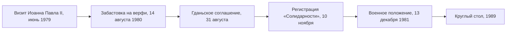

> Впервые в советском блоке власть подписала соглашение с бастующими рабочими и признала независимый от неё профсоюз.

## Откуда взялась забастовка

Летом 1980 года правительство подняло цены на мясо, и по стране прокатились забастовки.
14 августа встала Гданьская судоверфь имени Ленина: поводом стало увольнение крановщицы
Анны Валентынович, за пять месяцев до пенсии. Уже 16 августа дирекция согласилась на
экономические требования, но Валентынович и Алина Пеньковская уговорили рабочих
продолжить стачку из солидарности с другими предприятиями.

Так забастовка превратилась в движение. Межзаводской стачечный комитет во главе
с электриком Лехом Валенсой выдвинул 21 требование — от свободных профсоюзов и права
на забастовку до доступа церкви к радио и телевидению.

## Соглашение и профсоюз

31 августа в зале BHP верфи вице-премьер Мечислав Ягельский и Валенса подписали
соглашение. 17 сентября представители стачечных комитетов создали общенациональный
Независимый самоуправляемый профсоюз «Солидарность», и 10 ноября его зарегистрировали.
За год в него вступили около 10 миллионов человек — примерно треть работающего населения.

## Почему это важно

«Солидарность» была одновременно профсоюзом, гражданским движением и, по сути,
легальной оппозицией в однопартийном государстве. Её символами стали католическая
месса и портрет [[pl-john-paul-1978|Иоанна Павла II]] на воротах верфи. Власть
ответила [[pl-martial-law-1981|военным положением]], но запретить движение навсегда
не смогла: в 1989 году именно с «Солидарностью» коммунисты сели за
[[pl-round-table-1989|круглый стол]].

Лех Валенса получил Нобелевскую премию мира в 1983 году и стал президентом Польши в 1990-м.
Сегодня история движения представлена в Европейском центре «Солидарности» в Гданьске,
открытом в 2014 году рядом с воротами верфи.
