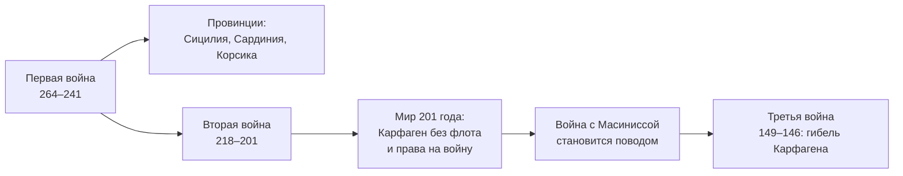

> Три войны за 118 лет превратили хозяина Италии в средиземноморскую державу.

## Причины

К 264 году до н. э. Рим закончил покорение Апеннинского полуострова ([[ref-p022-ekspansiya-rima-na-apenninskom-poluostrove]]), и в том же году его войска впервые вышли за пределы Италии — на Сицилию. Там они столкнулись с Карфагеном, городом финикийских переселенцев в Северной Африке. Две державы были главными силами Западного Средиземноморья, и спор за Сицилию стал спором о первенстве.

## Ход: три войны

| Война | Годы до н. э. | Главное | Итог для Карфагена |
| --- | --- | --- | --- |
| [[ref-p024-pervaya-punicheskaya-voyna]] | 264–241 | Бои на Сицилии, в окружающих водах и в Северной Африке | Отказ от Сицилии, контрибуция; в 238 году Рим отнимает Сардинию и Корсику |
| [[ref-p024-vtoraya-punicheskaya-voyna]] | 218–201 | Ганнибал воюет в Италии, побеждает при Каннах, но проигрывает при Заме | Флот — десять кораблей, 10 тысяч талантов за 50 лет, запрет воевать без согласия Рима |
| [[ref-p024-tretya-punicheskaya-voyna-gibel-karfagena]] | 149–146 | Осада города после войны Карфагена с Масиниссой | Город разрушен, около 50 тысяч жителей проданы в рабство, земли — провинция Африка |

О масштабе Второй войны говорят цифры [[ref-p024-pobeda-gannibala-nad-rimlyanami-pri-kannah|битвы при Каннах]] (216 год до н. э.): Тит Ливий пишет о 48 200 убитых римлянах, Полибий — о 70 тысячах. Даже если, как считают многие современные историки, эти цифры завышены, речь идёт о десятках тысяч погибших за один день. И всё же через четырнадцать лет, при Заме, Сципион разбил Ганнибала в Африке, и Карфаген принял мир на римских условиях.

## Последствия

**Провинции.** С Сицилии, Сардинии и Корсики началась система римских провинций: заморские земли платили десятину зерном и подчинялись наместникам, которых назначал сенат. После 146 года в Западном Средиземноморье у Рима не осталось соперника.

**Ловушка мира 201 года.** Договор запрещал Карфагену воевать без разрешения Рима. Когда нумидийский царь Масинисса, союзник Рима, стал захватывать карфагенские земли, ответный поход Карфагена дал Риму повод для последней войны.

## В это же время

> В 221 году до н. э., между Первой и Второй войнами, царство Цинь объединяет Китай. На двух концах Евразии почти одновременно складываются державы, которые определят историю своих регионов.
