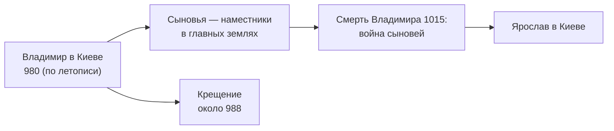

> Тридцать пять лет, за которые союз земель вокруг Днепра стал державой одной семьи.

## Как Владимир пришёл к власти

Святослав Игоревич разделил земли между тремя сыновьями: Ярополк сидел в Киеве, Олег —
у древлян, младший, Владимир, — в Новгороде. Вскоре братья начали воевать. Олег погиб;
Владимира Ярополк вытеснил из Новгорода, но тот вернулся с наёмниками-варягами. По дороге на юг он взял Полоцк —
с этим походом связана история княжны [[by-rogneda-980|Рогнеды]]. Ярополк сдался брату
и был убит.

Дату вокняжения источники называют по-разному. «Повесть временных лет» помещает эти
события под 980 годом; в другом древнерусском сочинении, «Памяти и похвале князю Владимиру»
Иакова Мниха, гибель Ярополка отнесена к 978 году. Поэтому год на шкале дан как условный.

## Как он управлял

Владимир сделал ставку на собственную семью. Сыновья, подрастая, получали в держание
главные города — Новгород, Полоцк, Туров, Ростов, Смоленск, Владимир-Волынский — и
правили там как наместники отца. Где сыновей не хватало, сидели доверенные люди: в
Новгороде посадником был Добрыня, а после его смерти — его сын Константин.

Главной внешней угрозой были кочевники-печенеги. Летопись рассказывает, что князь
приказал ставить крепости по рекам к югу и востоку от Киева и заселять их людьми из
северных земель. Так против степи выросла система пограничных крепостей.

## Выбор веры

Самое известное решение Владимира — [[ru-baptism-988|крещение Руси]]. Христианство пришло
из Византии, а вместе с ним — церковная организация, каменное строительство, книги на
церковнославянском языке. Через два поколения в Новгороде уже переписывали такие книги,
как [[rus-ostromir-1056|Остромирово Евангелие]].

## Что было после

Система «отец и сыновья-наместники» держалась, пока был жив отец. Когда Владимир умер
в 1015 году, сыновья начали борьбу за Киев. Её итогом стало княжение
[[ru-yaroslav-1019|Ярослава Мудрого]], но сама проблема — как делить власть внутри
разросшейся династии — осталась. Через восемьдесят лет её попытаются решить на
[[ref-p036-lyubechskiy-sezd-knyazey|Любечском съезде]].

