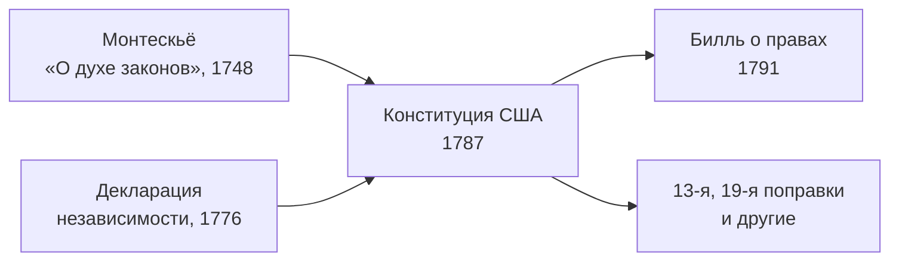

> Конституция, написанная за одно лето 1787 года, действует до сих пор — с 27 поправками.

## Почему понадобилась новая конституция

После [[ref-p051-deklaraciya-nezavisimosti-ssha|провозглашения независимости]] тринадцать
бывших колоний жили по Статьям конфедерации — союзному договору, при котором центральная
власть почти ничего не могла: у Конгресса не было своих налогов, армии и суда, а каждый
штат вёл себя как отдельное государство. Война за независимость закончилась Парижским
миром 1783 года, а долги, торговые споры между штатами и бунты должников остались.

## Филадельфия, 1787 год

Делегаты штатов собрались в Филадельфии 25 мая 1787 года, чтобы поправить Статьи
конфедерации, но вместо этого написали новый основной закон. Председательствовал
Джордж Вашингтон. Заседания шли при закрытых дверях почти четыре месяца, и 17 сентября
из 42 присутствовавших делегатов документ подписали 39.

Главные решения конвента:

| Вопрос | Решение |
| --- | --- |
| Кто издаёт законы | Конгресс из двух палат: в Сенате штаты представлены поровну, в Палате представителей — по численности населения |
| Кто исполняет законы | Президент, избираемый на четыре года коллегией выборщиков |
| Кто судит | Верховный суд и нижестоящие федеральные суды |
| Как власти сдерживают друг друга | Вето президента, которое Конгресс может преодолеть; утверждение Сенатом назначений и договоров; импичмент |
| Что остаётся штатам | Всё, что не передано федеральной власти |

## Ратификация

Конституция вступала в силу после одобрения девятью штатами из тринадцати. Спор между
сторонниками сильной федерации и их противниками шёл в газетах и на съездах штатов;
девятым 21 июня 1788 года стал Нью-Гэмпшир. Весной 1789 года начал работу первый
Конгресс, а 30 апреля присягу принёс первый президент — [[us-washington-1789|Вашингтон]].

Противники ратификации добились главного обещания: в конституцию будут внесены
гарантии прав личности. Так появился [[us-bill-of-rights-1791|Билль о правах]].

## Откуда идеи

Схема трёх отдельных ветвей власти опиралась на опыт английского парламентаризма,
конституций самих штатов и на политическую философию Просвещения — прежде всего на
учение [[fr-montesquieu-1748|Монтескьё]] о разделении властей.

## Долгая жизнь текста

Конституцию меняют поправками, а не переписывают. Через них страна отменила рабство
([[us-13th-amendment-1865]]) и дала право голоса женщинам ([[us-19th-amendment-1920]]),
а толкование текста Верховным судом позволило, например, признать незаконной школьную
сегрегацию ([[us-brown-1954]]).
