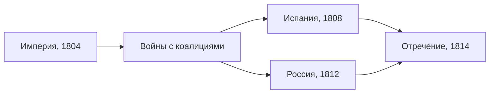

> Десять лет империи — это цепочка войн, в которой каждая победа открывала новый фронт.

## Империя без мира

Наполеон получил императорский титул в мае 1804 года, когда Франция уже воевала с
Британией. Почти всё десятилетие империи прошло в войнах с меняющимися коалициями
европейских держав. Победы на континенте позволили Франции перекроить его карту: в немецкой
колонке это видно по концу Священной Римской империи в 1806 году —
[[de-hre-end-1806]].

## Испания: 1808

Британию нельзя было разбить на суше, и Наполеон пытался закрыть для неё европейские
рынки. По договору в Фонтенбло 1807 года французские войска прошли через Испанию, чтобы
ударить по Португалии, британскому союзнику. Весной 1808 года французская армия уже
стояла в Мадриде.

В мае 1808 года в Байонне Наполеон вынудил отречься сначала Карла IV, затем его сына
Фердинанда VII и передал испанскую корону своему брату Жозефу. Ещё раньше, 2 мая, попытка
вывезти во Францию последних членов королевской семьи подняла Мадрид. Восстание подавили,
но призывы к вооружённой борьбе разошлись по всей стране — началась многолетняя война на
Пиренеях ([[es-1808]]).

## Россия: 1812

Второй фронт, который истощил империю, открылся на востоке. Поход 1812 года
([[ru-1812]]) закончился отступлением: к концу ноября остатки Великой армии с трудом
переправились через Березину ([[ref-p067-razgrom-francuzskoy-armii-na-reke-berezine]]),
и как боевая сила армия перестала существовать.

## 1814: конец

В 1813–1814 годах коалиция дошла до Парижа. В апреле 1814 года Сенат объявил императора
низложенным, а Наполеон подписал отречение в Фонтенбло
([[ref-p060-otrechenie-napoleona-ot-vlasti]]).

