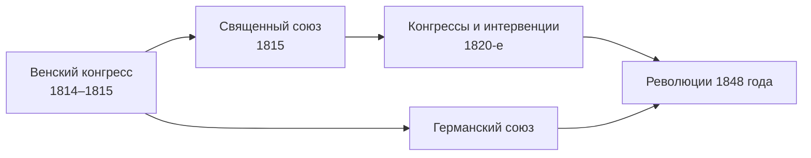

> Мир после Наполеона строили не по принципу «каждому народу — своё государство», а по принципу равновесия сил.

## Кто и зачем собрался

После первого отречения Наполеона победители — Россия, Австрия, Пруссия и Великобритания —
собрались в Вене, чтобы решить судьбу освобождённых земель. За стол переговоров вскоре
допустили и Францию, представленную Талейраном. Работа шла в закрытых комиссиях,
а балы и приёмы дали повод к знаменитой фразе «Конгресс танцует, но не движется».

## Что изменилось на карте

| Кто | Что получил |
| --- | --- |
| Российская империя | Большую часть Варшавского герцогства — Царство Польское |
| Пруссия | Часть Саксонии, Познань, земли на Рейне и в Вестфалии |
| Нидерланды | Бывшие Австрийские Нидерланды (Бельгию) |
| Германия | Вместо Священной Римской империи — Германский союз |

Логика многих решений была одна: окружить Францию поясом сильных соседей. Объединённые
Нидерланды прикрывали север, прусская Рейнская область — восток.

## Работорговля

8 февраля 1815 года восемь держав подписали декларацию о всеобщей отмене работорговли.
Это было первое многостороннее осуждение торговли людьми, но без конкретных обязательств,
кроме обещания вести дальнейшие переговоры, и без упоминания самого рабства.

## Сто дней

В марте 1815 года Наполеон бежал с Эльбы и вернулся к власти. Заключительный акт
конгресса подписали 9 июня 1815 года, за девять дней до [[fr-waterloo-1815|Ватерлоо]].

## Что было дальше

Порядок 1815 года охраняли [[ref-p061-sozdanie-svyaschennogo-soyuza|Священный союз]]
и система конгрессов великих держав. Самый сильный удар по нему нанесли
[[ref-p061-revolyucii-v-evrope|революции 1848 года]], поднявшие национальный вопрос,
который в Вене оставили в стороне.
