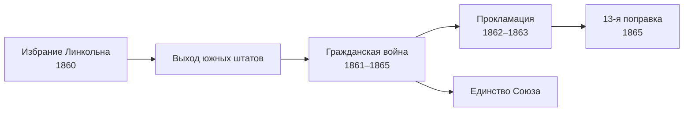

> Война, которая решила два вопроса сразу: может ли штат выйти из Союза и может ли
> в свободной республике существовать рабство.

## Причины

К середине XIX века Север и Юг жили по-разному. На Севере росли фабрики, города и
железные дороги, на Юге хлопковые плантации держались на труде рабов. Пока страна
расширялась на запад — после [[us-louisiana-1803|покупки Луизианы]] и
[[us-mexican-war-1846|войны с Мексикой]], — каждый новый штат ставил вопрос: будет
ли там разрешено рабство. Компромиссы откладывали конфликт, но не снимали его.

В 1860 году президентом избрали Авраама Линкольна, кандидата Республиканской партии,
выступавшей против распространения рабства на новые территории. Южные штаты один за
другим объявили о выходе из Союза и создали Конфедеративные Штаты Америки.

## Ход войны

| Дата | Событие |
| --- | --- |
| 12 апреля 1861 | Конфедераты обстреливают форт Самтер в Южной Каролине; через 34 часа гарнизон сдаётся |
| 22 сентября 1862 | [[ref-p062-proklamaciya-ob-osvobozhdenii-negrov-rabov|Предварительная прокламация об освобождении]] |
| 1 января 1863 | Прокламация вступает в силу в мятежных штатах |
| 9 апреля 1865 | Генерал Ли капитулирует при Аппоматтоксе |
| май — июнь 1865 | Последние бои и сдача последних отрядов конфедератов |

Север имел больше людей, заводов и железных дорог, контролировал флот и блокировал
южные порты. Юг рассчитывал выстоять в обороне и измотать противника. После прокламации об
освобождении война Севера стала и войной против рабства.

## Цена

Точного числа погибших нет. По оценкам, которые приводит American Battlefield Trust,
погибли от 620 до 750 тысяч солдат — больше, чем в любой другой войне в истории США.

## Итоги

Война решила, что выход штата из Союза невозможен, и [[us-13th-amendment-1865|13-я
поправка]] отменила рабство во всей стране. Но равенства бывшие рабы не получили: после
ухода федеральных войск с Юга там сложилась система расовой сегрегации, которую
разрушило лишь движение за гражданские права XX века ([[us-civil-rights-act-1964]]).
