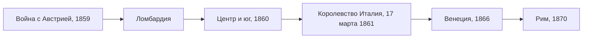

> Новое государство юридически было расширенным Сардинским королевством — это видно
> даже по номеру короля.

## Центр объединения

Объединение шло вокруг Сардинского королевства (Пьемонта), где правила Савойская
династия. В 1859 году Сардиния вместе с Францией воевала против Австрии и после победы
получила Ломбардию. Затем к ней присоединились государства Центральной Италии, часть
Папской области и Королевство Обеих Сицилий на юге.

## Как провозглашали королевство

| Дата | Шаг |
| --- | --- |
| 26 февраля 1861 | Сенат одобряет законопроект о новом титуле короля |
| 14 марта 1861 | Законопроект принимает Палата депутатов |
| 17 марта 1861 | Закон № 4671 Королевства Сардиния: Виктор Эммануил II принимает для себя и наследников титул короля Италии |

Король стал править «милостью Божией и волей нации». Номер «Второй» он сохранил:
новое королевство мыслилось как продолжение сардинского, а не как новое государство.
17 марта сегодня в Италии отмечают как День национального единства.

## Чего не хватало

Вне королевства остались Венеция, принадлежавшая Австрии, и Рим, где правил папа.
Венецию Италия получила после войны 1866 года по Венскому миру, Рим —
[[it-rome-1870|в 1870 году]]. Только после этого объединение можно было считать
завершённым.

## В это же время

> В 1860-е годы Пруссия объединяет Германию. Война 1866 года против Австрии
> была для обеих стран общей: Италия получила по её итогам Венецию, Пруссия —
> первенство в германских землях.
