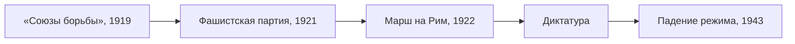

> Фашисты не взяли Рим штурмом: их пустили в правительство.

## Откуда взялось движение

[[ref-p078-sozdanie-soyuza-borby-v-italii|«Союзы борьбы»]], основанные Муссолини
в Милане в марте 1919 года, поначалу были маленьким движением. В 1921 году на их основе
возникла Национальная фашистская партия, у которой были свои вооружённые отряды —
чернорубашечники.

## Несколько дней в октябре

| Дата | Что произошло |
| --- | --- |
| 28 октября | Отряды фашистов занимают ключевые пункты в разных городах и собираются у Рима; правительство Луиджи Факты готовит указ об осадном положении, но король отказывается его подписать |
| 30 октября | Виктор Эммануил III назначает Муссолини премьер-министром и поручает ему сформировать коалиционное правительство |
| 31 октября | Чернорубашечники проходят парадом по Риму |

Власть перешла к фашистам без боя: решающим оказался не поход, а отказ короля
применить против него силу.

## Почему король уступил

Мотивы Виктора Эммануила III обсуждаются до сих пор. Среди объяснений, которые
приводят историки:

- страх, что отказ сотрудничать с фашистами будет стоить ему трона;
- желание избежать гражданской войны;
- надежда «обезвредить» фашистов, сделав их частью правительства.

## Что было дальше

Первое правительство Муссолини было коалиционным, но в следующие годы он избавился
от партнёров и оппозиции. Фашистский режим продержался более двадцати лет — до
[[it-fall-mussolini-1943|25 июля 1943 года]], когда Большой фашистский совет выразил
дуче недоверие, а король приказал его арестовать.

## В это же время

> Итальянский опыт показал, что прийти к власти можно не переворотом, а с согласия
> старых элит. Нацисты в Германии придут к власти так же — по назначению, в
> [[de-1933|1933 году]].
