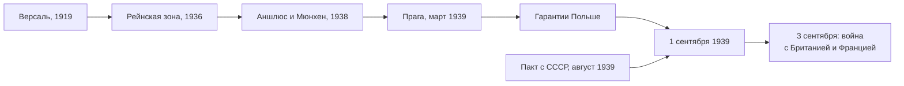

> Война, которую Германия начала 1 сентября 1939 года, готовилась шесть лет — шагами, каждый
> из которых проверял, ответят ли соседи силой.

## Шесть лет до войны

После прихода нацистов к власти ([[de-1933]]) Германия не сразу пошла на открытый разрыв
с Версальской системой. Первые годы она сочетала демонстративные выходы из международных
структур с двусторонними договорами, которые успокаивали соседей.

| Дата | Шаг | Ответ других держав |
| --- | --- | --- |
| 14 октября 1933 | Выход из Лиги Наций и с конференции по разоружению — [[ref-p082-vstuplenie-germanii-v-ligu-naciy]] | — |
| 26 января 1934 | [[ref-p083-zaklyuchenie-dogovora-o-nenapadenii-mezhdu]] | Польша получает гарантию на десять лет |
| 7 марта 1936 | [[ref-p084-okkupaciya-germanskimi-voyskami-reynskoy-d]] | Франция и Британия не отвечают силой |
| 12–13 марта 1938 | [[ref-p085-anshlyus-prisoedinenie-avstrii-k-germanii]] | — |
| 30 сентября 1938 | [[ref-p085-myunhenskaya-konferenciya-germanii-italii-]] | Британия и Франция сами соглашаются на передачу Судет |
| 15 марта 1939 | [[ref-p086-okkupaciya-chehoslovakii-germanskimi-voysk]] | Британия и Франция дают гарантии Польше |
| 28 апреля 1939 | Гитлер объявляет договор с Польшей утратившим силу | — |
| 23 августа 1939 | [[ref-p091-podpisanie-sovetsko-germanskogo-pakta-o-ne]] | Германия избавлена от угрозы войны на два фронта |

Поворотной точкой стал март 1939 года: после захвата Праги политика уступок
закончилась. 31 марта 1939 года Невилл Чемберлен объявил в палате общин,
что Британия поддержит Польшу, если её независимости будет угрожать опасность; Франция
присоединилась к этому обязательству.

## Сентябрь 1939 года

1 сентября германские войска перешли польскую границу, а авиация бомбила польские города.
Германия не ответила на британский ультиматум, и 3 сентября Великобритания, а вслед за ней
Франция объявили ей войну — так нападение на одну страну стало общеевропейской войной.

17 сентября, в соответствии с разграничением по секретному протоколу, на восток Польши
вошла Красная армия. В конце сентября капитулировала Варшава, и территория Польши была
разделена между Германией и СССР.

## Что было дальше

Для Германии война продолжалась пять лет и восемь месяцев и закончилась безоговорочной
капитуляцией ([[de-1945]]). Для СССР она началась 22 июня 1941 года ([[ru-1941]]),
и пакт 1939 года до сих пор оценивают по-разному — об этом в карточке пакта.
