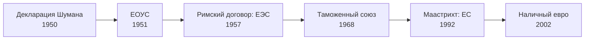

> Европейский союз вырос не из одного договора, а из цепочки шагов, каждый из которых опирался на предыдущий.

## Путь к Маастрихту

Всё началось с угля и стали: [[fr-schuman-1950|декларация Шумана]] привела к созданию
[[ref-p103-sozdanie-evropeyskogo-obedineniya-uglya-i-|ЕОУС]], а шесть его участников в 1957 году подписали
[[ref-p104-dogovor-ob-uchrezhdenii-evropeyskogo-ekono|Римский договор]] об общем рынке.
1 июля 1968 года таможенный союз был завершён на полтора года раньше срока. К 1992 году
сообщество выросло до двенадцати стран: в 1973 году в него [[gb-eec-1973|вошла Великобритания]],
в 1986-м — [[es-eec-1986|Испания]] и Португалия.

## Что изменил договор

Маастрихтский договор подписали 7 февраля 1992 года, в силу он вступил 1 ноября 1993 года.
Союз стоял на трёх опорах:

| Опора | Содержание |
| --- | --- |
| Европейские сообщества | Общий рынок; ЕЭС переименовано в Европейское сообщество |
| Общая внешняя политика и политика безопасности | Согласование позиций правительств |
| Юстиция и внутренние дела | Сотрудничество полиции, судов, миграционных служб |

Договор ввёл гражданство Европейского союза и наметил этапы экономического и валютного
союза с единой валютой. Наличные евро появились в 2002 году — см. [[de-euro-2002]].

## Трудная ратификация

Договор подписали через полтора месяца после [[ru-1991|распада СССР]] и через два года после
[[de-reunification-1990|объединения Германии]]. В июне 1992 года датчане отвергли его на
референдуме и одобрили только после оговорок, а французы на референдуме в сентябре
поддержали его минимальным большинством. Споры о том, сколько полномочий передавать
Брюсселю, остались главной темой европейской политики — вплоть до
[[gb-brexit-2016|британского референдума 2016 года]].
