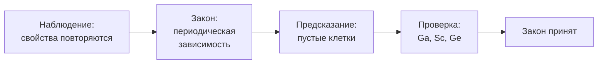

> Таблица, которая не просто упорядочила известное, но предсказала неизвестное.

## Периодический закон

Менделеев расположил элементы по возрастанию атомной массы и заметил, что свойства
повторяются через определённые промежутки. Современная формулировка опирается
на заряд ядра $Z$: свойства элементов периодически зависят от $Z$.

Ключевой ход был не в таблице как таковой — похожие пробовали и до него.
Ключевым было решение **оставить пустые клетки** там, где закономерность требовала
элемента, которого никто не находил.

| Предсказание, 1871 | Открыт | Название | Расхождение по массе |
| --- | --- | --- | --- |
| эка-алюминий | 1875 | галлий | менее 1% |
| эка-бор | 1879 | скандий | около 2% |
| эка-кремний | 1886 | германий | менее 1% |

Для эка-кремния Менделеев указал не только массу $\approx 72$, но и плотность
$\approx 5{,}5\ \text{г}/\text{см}^3$, и то, что оксид будет иметь формулу $\mathrm{EsO_2}$.
Германий оказался ровно таким.

## Почему это эталон научного метода

Теория, которая только объясняет уже известное, слабее теории, которая **рискует**:
делает проверяемое утверждение о том, чего ещё никто не видел. Периодический закон
рискнул трижды и трижды оказался прав.

Русская наука вышла на мировой уровень одновременно с Великими реформами:
университеты, лаборатории и научные журналы появились в стране за одно поколение.
