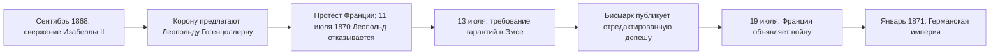

> Как свержение испанской королевы стало поводом к войне, после которой появилась Германская империя.

## Сентябрь 1868 года

19 сентября в Кадисе восстала эскадра адмирала Топете. К мятежу присоединились
генералы Прим и Серрано, по стране возникли революционные хунты. После поражения
правительственных войск при Альколеа кабинет ушёл в отставку, и 29 сентября Изабелла II уехала
в изгнание. Начался период, который испанские историки называют **«демократическим шестилетием»**
(1868–1874): первый опыт демократического режима — сначала в форме парламентской монархии,
затем республики.

## Поиск короля

Новой власти нужен был монарх, и испанский престол предложили принцу Леопольду
Гогенцоллерн-Зигмарингену — родственнику прусского королевского дома. Франция Наполеона III
увидела в этом угрозу оказаться между двумя государствами, связанными с Гогенцоллернами.

Даже после того как 11 июля 1870 года кандидатура была отозвана, французский посол Бенедетти
потребовал от прусского короля Вильгельма I гарантии, что Гогенцоллерны больше никогда не будут
претендовать на испанский трон. Король вежливо отказал, а Бисмарк обнародовал сокращённый
пересказ этой беседы — так называемую Эмсскую депешу, — отредактированный так, чтобы
расхождение между королём и послом выглядело острее. 19 июля Франция объявила войну: так началась [[ref-p064-franko-prusskaya-voyna]],
закончившаяся [[de-empire-1871|провозглашением Германской империи]].

## Итог для Испании

В ноябре 1870 года кортесы избрали королём итальянского принца Амадея Савойского. Он продержался
чуть больше двух лет и в феврале 1873 года отрёкся, после чего была провозглашена
[[es-first-republic-1873|Первая республика]].
