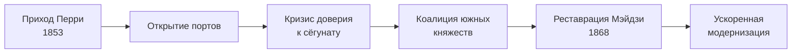

Перри прибыл не для войны, но опирался на очевидную военную угрозу. Канагавский договор
1854 года открыл два порта для снабжения американских судов; гораздо более широкие
торговые права и неравные условия закрепил договор Харриса 1858 года.

Внешнее давление не создало оппозицию сёгунату с нуля. Оно раскололо элиты вокруг
вопроса, кто вправе заключать договоры, усилило домены Сацума и Тёсю и сделало
неспособность бакуфу контролировать внешнюю политику видимой всей стране.

Дальше сработала внутренняя логика:

За пятнадцать лет внешний вызов превратился во внутреннюю борьбу за устройство власти.
Реставрация Мэйдзи стала её исходом, а не заранее заданным ответом на появление эскадры.
