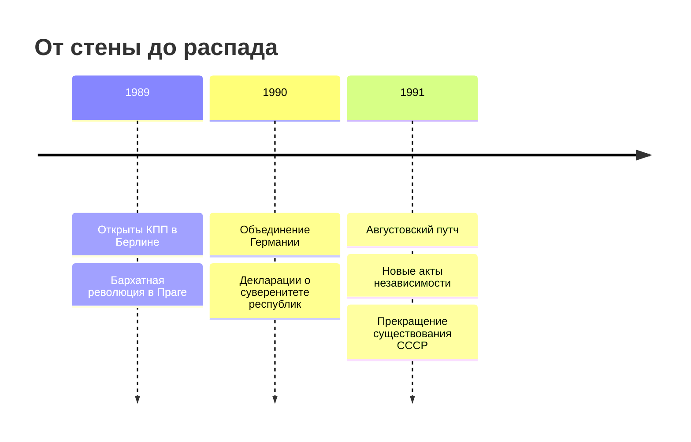

Падение Берлинской стены не вызвало распад СССР. Оба события входят в более широкий
кризис: реформы Горбачёва, отказ от военного удержания союзников, массовые движения
в Восточной Европе и рост суверенитетов внутри самого Союза.

Между открытием переходов 9 ноября 1989 года и прекращением существования СССР прошло
чуть больше двух лет. Близость дат показывает скорость распада прежнего порядка,
но не превращает Берлин в единственную причину событий в Москве и республиках.
