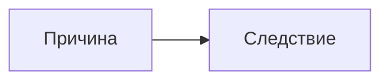

# Свод правил наполнения базы «Синхронии»

Этот документ адресован **людям и AI-ассистентам, которые добавляют в проект новые
события, деятелей и связи**. Он описывает не стиль кода, а требования к фактам:
откуда их брать, как проверять и в какой форме записывать.

Читайте его целиком перед первым добавлением. Дальше держите под рукой
[чек-лист](#13-чек-лист-перед-коммитом) — его достаточно для рутинной работы.

---

## 1. Что это за проект и что в нём считается ценным

«Синхрония» — синхронная хронология: события разных стран стоят на одной вертикальной
шкале, чтобы было видно **одновременность** процессов. Аудитория — люди без специальной
подготовки: школьники, студенты, преподаватели.

Из этого следуют три вещи, которые определяют всё остальное:

1. **Ценен не факт сам по себе, а факт в сравнении.** Событие, которое ничего не добавляет
   к пониманию эпохи и ни с чем не перекликается, базу только засоряет.
2. **Текст должен быть понятен без предварительных знаний.** Никаких «как известно»,
   «очевидно» и терминов без пояснения.
3. **Достоверность важнее полноты.** Лучше 200 выверенных объектов, чем 2000 сомнительных.
   Непроверенный факт не добавляется — вообще, ни с какой пометкой.

---

## 2. Главное правило: 100 % уверенность в факте

> **Объект добавляется в базу только тогда, когда факт подтверждён минимум двумя
> независимыми авторитетными источниками, из которых хотя бы один — не энциклопедия.**

«Независимые» означает, что источники не переписывают друг у друга. Три сайта,
пересказывающих одну и ту же статью Википедии, — это один источник, а не три.

### 2.1. Порядок проверки

1. Найдите факт в энциклопедии (Википедия годится) — это **отправная точка, а не
   доказательство**.
2. Откройте сноски этой статьи и дойдите до того, на что она ссылается: монографии,
   публикации документов, сайты архивов и музеев.
3. Подтвердите факт минимум ещё одним источником, независимым от первого.
4. Сверьте **дату, имена, числа и формулировку** во всех источниках.
5. Запишите источники в поле `sources` — все, по которым проверяли, а не один «для галочки».

### 2.2. Что делать при расхождении

| Что расходится | Что делать |
| --- | --- |
| Дата отличается на дни из-за календаря | Записать по григорианскому стилю, старый стиль указать в тексте — см. [§6](#6-даты-и-календари) |
| Дата принципиально разная в равных по весу источниках | **Не добавлять**, пока не найдено объяснение расхождения |
| Числа (потери, тиражи, население) расходятся | Писать диапазон: «по разным оценкам, от … до …», и указать, чьи это оценки |
| Расходятся **оценки**, а не факт | Это трактовки — оформить через `viewpoints`, см. [§7](#7-спорные-трактовки) |
| Факт есть только в одном источнике | **Не добавлять** |

### 2.3. Чего делать нельзя

- Реконструировать дату «по смыслу», если её нет в источниках.
- Ставить месяц или день, если известен только год. Пустое поле честнее выдуманного января —
  и шкала это учитывает: объект без месяца не дробится при увеличении.
- Переносить в базу оценочные формулировки из источника, не назвав, кому они принадлежат.
- Добавлять факт, потому что «это общеизвестно». Общеизвестное тоже проверяется.

---

## 3. Какие источники считаются авторитетными

По убыванию веса при подтверждении:

| `kind` | Что это | Примеры |
| --- | --- | --- |
| `archive` | Публикация документа, государственный или институциональный архив | ПСРЛ, Bundesarchiv, Archivo General de Indias, National Security Archive |
| `academic` | Монография, рецензируемая статья, национальный биографический словарь | Deutsche Biographie, Real Academia de la Historia, издания академических институтов |
| `institution` | Профильный музей, национальная библиотека, университетский проект | Национальная библиотека Беларуси, Мемориальный музей мира в Хиросиме, Stiftung Berliner Mauer |
| `encyclopedia` | Энциклопедия | Britannica, Большая российская энциклопедия, Беларуская энцыклапедыя, Википедия |

**Про Википедию отдельно.** Ею удобно начинать и по ней удобно находить литературу,
но она никогда не бывает единственным источником и никогда не бывает единственным
подтверждением спорного места. Ссылку на неё можно оставить в тексте статьи как
«подробнее», но в `sources` она идёт наравне с другими энциклопедиями — и всегда
в компании источника другого типа.

**Чего избегать:** блоги, агрегаторы «интересных фактов», нейросетевые пересказы,
учебные сайты без указания авторства, YouTube-ролики, форумы. Если у материала нет автора
и списка литературы — он не источник.

---

## 4. Структура объекта

Полное описание типа — в [`src/types.ts`](../src/types.ts). Практический минимум:

```ts
{
  id: 'de-luther-1517',       // <код страны>-<короткое имя>-<год>, латиницей, уникальный
  country: 'germany',
  year: 1517,
  month: 10,                  // только если известен
  day: 31,                    // только если известен
  endYear: undefined,         // для процессов: 1618 → endYear: 1648
  kind: 'person',             // 'event' — что произошло, 'person' — через кого понять эпоху
  title: 'Мартин Лютер и 95 тезисов',
  summary: 'Одно предложение: что произошло.',
  detail: 'Два-четыре предложения: что, почему важно, как связано с соседями.',
  life: '1483–1546',          // только для kind: 'person'
  tags: ['Реформация', 'религия', 'книгопечатание'],
  importance: 3,              // 3 — веха эпохи, 2 — заметное, 1 — контекст
  parallel: 'Что в это же время происходило в других странах.',
  approximate: false,         // true, если год условный или реконструированный
}
```

### 4.1. Как выбрать страну

Страна — это **линия, чью историю объект объясняет**, а не паспорт и не место рождения.

- Франциск Скорина печатался в Праге и Вильне → линия Беларуси: он объясняет её культурную историю.
- Мария Склодовская-Кюри родилась в Варшаве → линия Франции: её открытия — часть французской науки.
- Для ранних веков страна означает территорию и традицию, а не государство
  в современных границах. Пояснение к каждой линии — в [`src/data/countries.ts`](../src/data/countries.ts).
- Древние государства — **отдельные линии**, а не ранние века современных стран:
  римское событие идёт в `ancient-rome`, а не в `italy`. Читателю они всё равно видны
  вместе: колонка наследника показывает линию предшественника отдельной дорожкой —
  см. таблицу `predecessors` в [`src/data/countries.ts`](../src/data/countries.ts).

### 4.2. Как выбрать год

Для события — год, когда оно произошло. Для деятеля — **год ключевого действия**,
а не рождения: публикация, приход к власти, реформа, открытие, премия, поход.
Так человек встаёт рядом с событиями, которые он объясняет.

### 4.3. Как выбрать `importance`

| Вес | Критерий | Проверочный вопрос |
| --- | --- | --- |
| `3` | Опорная веха эпохи | Изменилось ли после этого устройство страны или её место в мире? |
| `2` | Заметное событие | Останется ли это в школьном курсе? |
| `1` | Контекст, деталь | Помогает ли понять фон, но само по себе не поворотное? |

Вес `3` — дефицитный ресурс: на страну их должно быть 8–12, а не 25.

### 4.4. Как выбрать теги

Теги — это темы, по которым читатель захочет собрать сквозной срез: `война`, `реформы`,
`книгопечатание`, `наука`, `религия`, `революция`, `эпидемия`, `технологии`.
Сначала посмотрите [существующий список](../src/data/timelineItems.ts) (`allTags`)
и переиспользуйте формулировки — новый синоним к имеющемуся тегу вредит фильтру.
Три-четыре тега на объект достаточно.

---

## 5. Правила текстов

| Поле | Длина | Отвечает на вопрос |
| --- | --- | --- |
| `title` | до 45 знаков | Как это называется |
| `summary` | **одно** предложение | Что произошло |
| `detail` | 2–4 предложения | Что произошло, почему важно, как связано с соседями |
| `parallel` | 1–2 предложения | Что в это же время происходило в других странах |
| `body` | статья в Markdown | Всё остальное |

Тон: спокойный, без пафоса и без канцелярита. Пишите так, как объясняли бы
заинтересованному человеку, который просто не знает этого периода.

- **Плохо:** «Данное событие имело важнейшее значение для последующего исторического развития».
- **Хорошо:** «После этого граница между романизированной Европой и Европой вне империи
  держалась четыре века».

Избегайте: «как известно», «безусловно», «величайший», «трагически», «к сожалению».
Оценку даёт читатель, наша работа — дать ему факты и масштаб.

---

## 6. Даты и календари

**В полях `year`, `month`, `day` всегда григорианский календарь (новый стиль).**
Старый стиль, если он важен, упоминается в тексте.

Это особенно касается России до 1918 года, Британии до 1752-го и православных стран:

- Отмена крепостного права: `year: 1861, month: 3, day: 3`, в тексте — «19 февраля
  (3 марта) 1861 года».
- Октябрьская революция: события 25 октября по старому стилю — это 7 ноября по новому.

Другие правила:

- Известен только год → `month` и `day` не заполняются. Не подставляйте январь.
- Год условный, спорный или реконструированный → `approximate: true`. Такой объект
  показывается как «около» и не участвует в подневной детализации.
- Процесс, а не точка → `endYear`. Шкала нарисует две штриховые линии: к началу и к концу.
- До нашей эры проект пока не поддерживает: шкала начинается с 1 года н. э.

---

## 7. Спорные трактовки

Отличайте два случая:

- **Расходятся факты** (дата, число, авторство) → объект не добавляется до выяснения.
- **Расходятся оценки** при согласии о фактах → это `viewpoints`.

Второй случай — норма для истории, и шкала показывает его честно: разными оттенками,
с обязательной атрибуцией.

```ts
viewpoints: [
  {
    id: 'vp-mongols-classic',
    label: 'Классическая российская историография',  // ЧЬЯ это позиция — обязательно
    tone: 1,                                          // 1–4, просто разные оттенки
    text: 'Изложение позиции в Markdown.',
    sources: [{ label: '…', kind: 'academic' }],
  },
  // …
]
```

Требования к трактовкам:

1. **Атрибуция обязательна.** Не «одни считают», а «классическая российская историография»,
   «латиноамериканская индихенистская традиция», «японская мемориальная традиция».
2. **Излагайте позицию так, как её изложил бы её носитель** — с её сильными аргументами,
   а не в виде карикатуры.
3. **Не назначайте победителя.** Задача шкалы — показать, что расхождение существует,
   и назвать стороны. Читатель решает сам.
4. **Не выдумывайте спор.** Если расхождения нет в литературе, `viewpoints` не нужны.
5. У каждой трактовки обязательны свои источники: нужно подтвердить не только общий факт,
   но и то, что такая позиция действительно представлена в историографии.

Трактовки записываются в шапке файла содержания объекта — см. [§10.1](#101-формат-файла-содержания).
Готовые примеры: монгольское нашествие, 1492 год, Люблинская уния, атомные бомбардировки,
опиумные войны — файлы `content/items/russia/ru-mongols-1237.md`,
`content/items/spain/es-1492.md` и соседние.

---

## 8. Связи между событиями

Связь — это проверяемое содержательное отношение, а не случайное совпадение. Для
`influence` проверочный вопрос звучит так: *можно ли назвать механизм, которым одно
повлияло на другое, и подтвердить его источником?* Если механизма нет, причинную стрелку
ставить нельзя: используйте более точный симметричный вид либо оставьте одновременность
самой шкале.

```ts
{
  id: 'rel-gutenberg-luther',
  from: 'de-gutenberg-1455',   // импульс; порядок значим для influence
  to: 'de-luther-1517',        // результат
  kind: 'influence',
  label: 'Печать ускорила распространение идей Реформации',
  detail: '…объяснение в Markdown: что именно и как повлияло…',
}
```

| `kind` | Когда использовать |
| --- | --- |
| `influence` | Направленное влияние с названным механизмом: технология, идея, реформа, следствие |
| `conflict` | Стороны одного противостояния; порядок объектов не задаёт причину и следствие |
| `exchange` | Подтверждённый обмен людьми, знаниями, товарами или практиками |
| `comparison` | Аналитически полезное сопоставление без утверждения о прямом контакте |
| `context` | Общий процесс или историческая обстановка, связывающая два события без прямой причинности |

### 8.1. Автоподбор кандидатов

Перед добавлением связей прогоните новый объект через
[`suggestRelations`](../src/lib/suggestRelations.ts) — та же функция работает
в конструкторе на сайте и показывает кандидатов прямо в форме.

```ts
import { suggestRelations } from './src/lib/suggestRelations';

suggestRelations(
  { country: 'england', year: 1687, tags: ['наука', 'физика'] },
  timelineItems,
  relations,
);
// → [{ item, score, reasons: ['общие темы: наука', 'разница 18 лет', 'другая страна'], … }]
```

Алгоритм видит только совпадение тем, близость во времени и разные страны.
**Он не видит причинность.** Его выдача — список гипотез для проверки, а не готовые связи.
Каждого кандидата нужно либо подтвердить источником, либо отбросить.

### 8.2. Сколько связей нормально

Две-четыре на значимый объект. Десять связей у одного события означают, что часть из них —
натяжка. Связь `3`-й важности с объектом `1`-й важности почти всегда лишняя.

---

## 9. Markdown в статьях

Статья — это всё, что идёт после шапки в файле `content/items/<страна>/<id>.md`
(см. [§10.1](#101-формат-файла-содержания)). Если статьи нет, окно соберётся автоматически
из полей карточки — это нормально, длинные тексты пишутся постепенно.

Поддерживается полный Markdown с расширениями GFM плюс три дополнения:

### 9.1. Ссылки между статьями (как в Obsidian)

```md
[[de-luther-1517]]                    → ссылка с заголовком объекта
[[de-luther-1517|его тезисы]]         → ссылка с своей подписью
```

Ссылка открывает статью связанного объекта прямо из текста. Если идентификатора нет
в базе, ссылка останется видимым текстом в моноширинном начертании — ошибка сразу заметна.

Ставьте такие ссылки там, где читатель наверняка захочет провалиться: при первом
упоминании другого события или человека, у которого есть своя карточка.

### 9.2. Формулы

```md
Инлайн: масса покоя $m_0$ и энергия $E = mc^2$.

Блоком — три отдельные строки:

$$
\gamma = \frac{1}{\sqrt{1 - v^2/c^2}}
$$
```

⚠️ **Важно:** `$$формула$$` в одну строку разбирается как инлайн-формула.
Блочная формула требует `$$` на отдельных строках.

### 9.3. Диаграммы

````md

````

Mermaid берёт цвета текущей темы. Уместны схемы причинно-следственных цепочек
и хронологические ленты; не стоит рисовать диаграмму ради диаграммы.

---

## 10. Куда что класть

У объекта хронологии два файла, и только два.

```text
src/data/items/<страна>.ts          карточка: дата, заголовок, summary, detail, теги
content/items/<страна>/<id>.md      источники, трактовки и статья
```

У объектов слоя ровно та же пара, только в своих папках:

```text
src/data/layers.ts                  карточки слоя
content/layers/<слой>/<id>.md       источники, трактовки и статья
```

```text
src/data/
  relations.ts          связи — по необходимости
  countries.ts          новая страна: id, подпись, пояснение линии, цвет
  layers.ts             слои — отдельные сюжеты поверх шкалы
```

**Добавить объект** — одна запись в файл своей страны и один файл в `content/items/`.
Всё остальное подхватится автоматически: сортировка, фильтры, кольца дат,
детализация по месяцам.

**Добавить страну** — файл в `items/`, строка в `timelineItems.ts`, запись
в `countries.ts`, папка в `content/items/`. Больше ничего.

### 10.1. Формат файла содержания

```md
---
id: de-luther-1517
sources:
  - kind: encyclopedia
    label: "Britannica: Martin Luther"
    url: "https://www.britannica.com/biography/Martin-Luther"
  - kind: academic
    label: "Deutsche Biographie: Luther, Martin"
viewpoints:
  - id: vp-luther-confessional
    label: "Конфессиональная традиция"
    tone: 1
    text: |-
      Текст трактовки в Markdown. Многострочный — через `|-`.
---

## Заголовок статьи

Обычный Markdown: таблицы, формулы, диаграммы, ссылки `[[id]]`.
```

Правила формата:

- **Имя файла — это идентификатор объекта.** `content/items/germany/de-luther-1517.md`
  соответствует записи с `id: 'de-luther-1517'`. Поле `id` в шапке дублирует его для наглядности.
- **Шапка обязательна, статья — нет.** Файл только с источниками — нормальный, законченный файл.
  Если статьи нет, окно соберётся из полей карточки.
- **`url` ставится только после того, как ссылку действительно открыли.** Источник без `url`
  — полноценный источник: так цитируются публикации документов, летописи, монографии.
  Мёртвая или выдуманная ссылка хуже её отсутствия.
- `kind` — один из `archive`, `academic`, `institution`, `encyclopedia` (см. [§3](#3-какие-источники-считаются-авторитетными)).
- Строки в кавычках — обычный YAML: двоеточие в подписи требует кавычек.

---

## 11. Пошаговый рецепт для AI

1. **Выберите пробел.** Посмотрите, каких эпох или тем в линии не хватает.
   Ровное покрытие важнее плотности в любимом столетии.
2. **Найдите факт** и проверьте его по [§2](#2-главное-правило-100--уверенность-в-факте).
   Если подтверждения нет — переходите к следующему кандидату, не «додумывайте».
3. **Определите** страну ([§4.1](#41-как-выбрать-страну)), год ([§4.2](#42-как-выбрать-год)),
   тип, вес, теги.
4. **Напишите тексты** по [§5](#5-правила-текстов). Начните с `summary`: если событие
   не укладывается в одно предложение, вы ещё не поняли его сути.
5. **Проверьте дату** по [§6](#6-даты-и-календари) — особенно календарь.
6. **Проверьте, нет ли спора об оценках.** Если есть — оформите `viewpoints` по [§7](#7-спорные-трактовки).
7. **Прогоните `suggestRelations`** и проверьте каждого кандидата: есть ли механизм влияния?
8. **Создайте файл содержания** `content/items/<страна>/<id>.md` и запишите в его шапку
   `sources` — все источники, по которым проверяли ([§10.1](#101-формат-файла-содержания)).
9. **Пройдите чек-лист** и запускайте `npm run build` и `npm run lint`.

---

## 12. Примеры

### 12.1. Хорошо

```ts
{
  id: 'cn-diamond-sutra-868',
  country: 'china', year: 868,
  kind: 'event',
  title: 'Первая датированная печатная книга',
  summary: 'Ксилографическая «Алмазная сутра» выходит за 587 лет до Библии Гутенберга.',
  detail:
    'Печать с досок распространилась в Китае вместе с буддийскими текстами и календарями. ' +
    'В XI веке Би Шэн изобрёл и наборный шрифт, но иероглифическое письмо делало его менее ' +
    'выгодным. Технология шла с востока на запад медленно и по частям.',
  tags: ['книгопечатание', 'технологии'],
  importance: 3,
  parallel: 'Сравните с 1455 годом в немецкой колонке: та же идея дала в Европе взрывной эффект на пять веков позже.',
}
```

Почему хорошо: точная датировка из колофона самой книги, `summary` сразу даёт масштаб
сравнением, `parallel` работает на главную идею проекта, теги переиспользованы.

### 12.2. Плохо

```ts
{
  id: 'event-1', country: 'france', year: 1200, month: 1, day: 1,
  kind: 'event',
  title: 'Средневековая Франция переживала важные перемены',
  summary: 'В этот период происходило много важных событий, повлиявших на историю.',
  detail: 'Как известно, Средние века были сложным временем.',
  tags: ['история', 'средневековье', 'важное', 'франция', 'европа'],
  importance: 3,
}
```

Что не так: нечитаемый `id`; выдуманные месяц и день; заголовок ни о чём; `summary`
не сообщает факта; `detail` начинается с «как известно»; теги дублируют страну и эпоху,
которые и так есть в полях; вес `3` без основания; ни одного источника.

---

## 13. Чек-лист перед коммитом

**Факт**
- [ ] Подтверждён минимум двумя независимыми источниками
- [ ] Хотя бы один источник — не энциклопедия
- [ ] Все источники записаны в `sources` с указанием `kind`
- [ ] `url` стоит только у тех источников, чью ссылку действительно открывали
- [ ] Дата сверена, календарь — григорианский
- [ ] Месяц и день указаны только если действительно известны

**Объект**
- [ ] Есть оба файла: карточка в `src/data/items/` и содержание в `content/items/`
- [ ] Имя файла содержания совпадает с `id` объекта
- [ ] `id` уникален и читается: `<страна>-<имя>-<год>`
- [ ] Страна выбрана по линии, которую объект объясняет
- [ ] Год — год действия, а не рождения
- [ ] `importance` обоснован, вехи не размножены
- [ ] Теги переиспользованы из существующих

**Тексты**
- [ ] `summary` — одно предложение с фактом
- [ ] `detail` — 2–4 предложения: что, почему важно, как связано
- [ ] Нет «как известно», «безусловно», «величайший»
- [ ] Оценки атрибутированы, а не поданы как факт

**Спорное**
- [ ] Проверено, есть ли расхождение в оценках
- [ ] Если есть — оформлено через `viewpoints` с атрибуцией и источниками

**Связи**
- [ ] Прогнан `suggestRelations`
- [ ] Для каждой связи назван механизм влияния, а не совпадение
- [ ] `kind` выбран осознанно

**Техника**
- [ ] `npm run build` проходит
- [ ] `npm run lint` проходит
- [ ] Wiki-ссылки `[[id]]` ведут на существующие объекты
- [ ] Блочные формулы записаны с `$$` на отдельных строках

---

## 14. Если сомневаетесь

Правило одно: **сомневаетесь — не добавляйте**. Пустая клетка на шкале честнее
неточной. База растёт медленно и надёжно, и это её главное качество.
